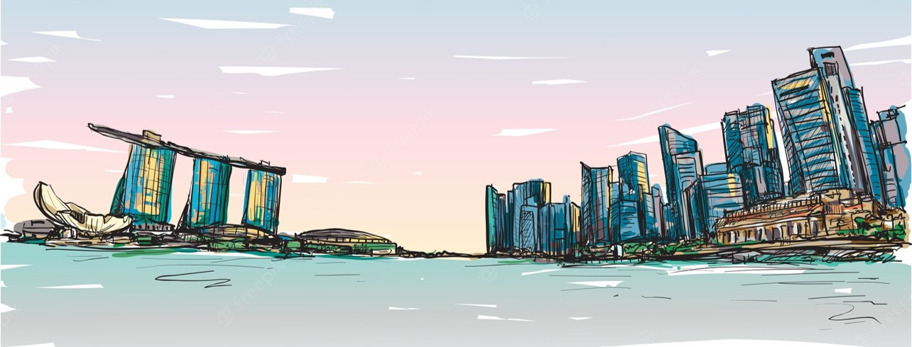

# Lyric Generator for Singapore NDP Songs

<p align="center">
  
</p>

We experiment with generating song lyrics with various NN architectures, trained on a corpus of Singapore patriotic songs.

## Project Directory Structure

```
.
├── data                <- data storage for song lyrics
├── images              <- storing images
├── output              <- storing generated lyrics and other outputs
│   ├── archive         <- for archive files
├── src                 <- all source code, internal org as needed
│   ├── bin             <- notebooks for training, evaluation etc
│   ├── lib             <- source and utilities code
```

## The NDP 2023 AI-Generated Theme Song 

https://user-images.githubusercontent.com/58768271/175760305-2ff60a79-bdf3-47a9-a4d5-147833d6359b.mp4

<br>
<b>VERSE 1​</b> <br>
Here in this country I call home​ <br>
Nothing in this world compares​ <br>
it's our Singaporean life​ <br>
Everyone is family friend and neighbour​ <br>
Living in harmony​ <br><br>

<b>PRE-CHORUS</b> <br>​
Nothing in this world compares​ <br>
Nothing in this world compares​ <br>
to this island where it's home surely, it's home surely​ <br>
Where we love and joy for all of us​ is peace​ <br>

<b>CHORUS​</b> <br>
Sing a thousand streams flow to make one river grow​ <br>
(Another stream together)​ <br>
This is my people living deck​ <br>
So there's like paradise​ <br>
A sea of green on a wave as long ago​ <br>
As the morning begins anew​ <br>
And afternoon has come true​ <br>

<b>VERSE 2</b>​ <br>
Life is here to me​ <br>
in every shore too​ <br>
There's up above​ <br>
till I am born everyday​ <br>
Because tomorrow night feeling lives​ <br>
Are gone by day you are away​ <br>
I'll be late evening​ <br>
cos that dawns again awake 

<b>CHORUS</b> <br>
<b>CHORUS</b> <br>

Here in this country I call home...​
